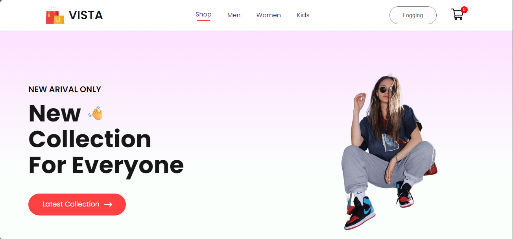
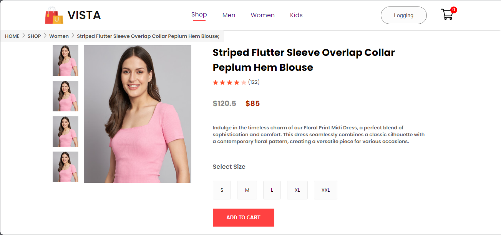
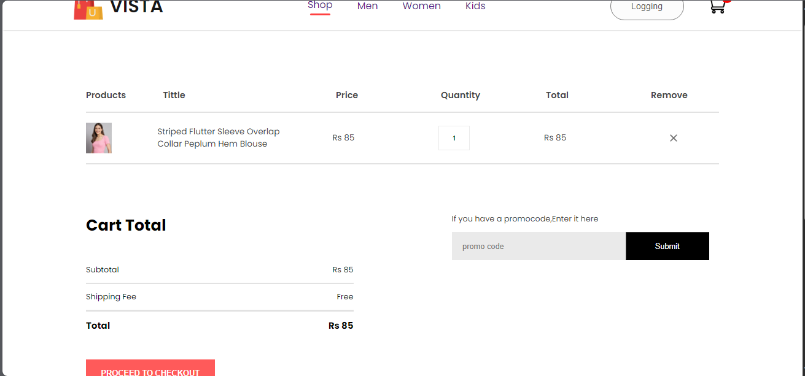

# VISTA E-Commerce App - Frontend

## Overview

Welcome to the VISTA E-Commerce App frontend repository! This React.js-based project serves as the frontend for an e-commerce application specifically designed for a clothing shop.

## Features

- Browse a wide range of clothing products.
- View detailed product information.
- Add products to the shopping cart.
- Seamless checkout process.
- User authentication

## Technologies Used

- **React.js**: A JavaScript library for building user interfaces.

## Screenshots

*Home page hero section with navigation of the website.*

*One Product View.*

*Cart Page View.*

---

Happy shopping with VISTA E-Commerce App!  🛍️
